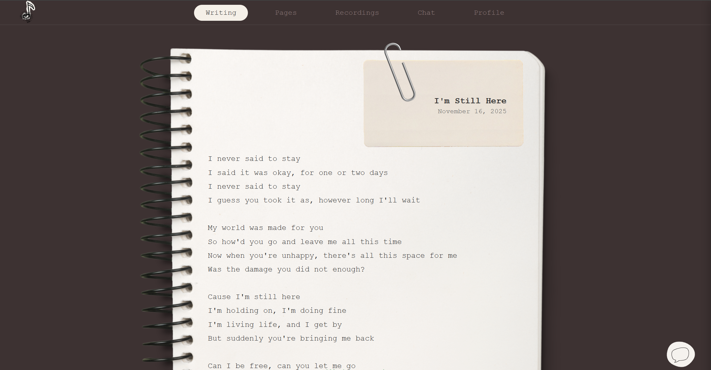
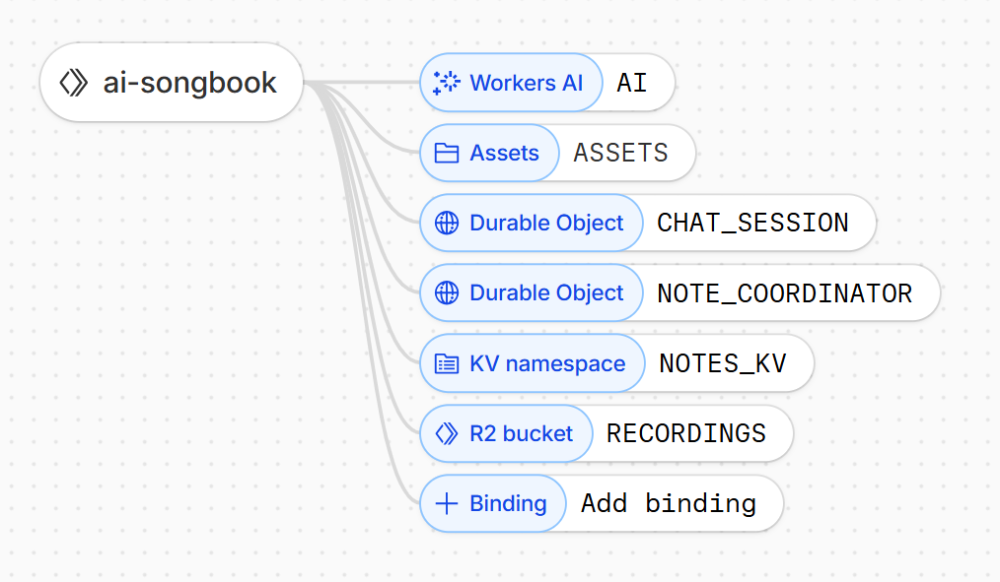

# AI Songwriting Notebook

A personal AI-powered songwriting assistant built with Cloudflare Workers. Features a notebook-style interface for writing lyrics with real-time AI collaboration.

## Live Demo

**Deployed at:** [Your deployment URL here] to Cloudflare Workers.



> **Note:** This is a personal project meant for my own songwriting - all data is shared globally if you access this site.

## Features

- **Writing Page** - Notebook editor with AI co-writer sidebar
- **Chat** - Full conversation with AI assistant (Llama 3.3)
- **Pages** - Browse all your songs
- **Recordings** - Upload and manage voice memos
- **Profile** - Track stats

## Tech Stack

Built entirely on Cloudflare:
- **Workers** - Serverless backend
- **Hono** - Web framework with JSX
- **Workers AI** - Llama 3.3 model
- **Durable Objects** - Chat sessions
- **KV** - Metadata storage
- **R2** - Audio file storage

**Binding configuration:**



## Setup

### 1. Install Dependencies

```bash
npm install
```

### 2. Create Cloudflare Resources

Enable R2 in your Cloudflare dashboard, then create:

```bash
# KV namespace (note: use space, not colon)
npx wrangler kv namespace create NOTES_KV

# R2 buckets
npx wrangler r2 bucket create songbook-recordings
npx wrangler r2 bucket create songbook-recordings-dev
```

### 3. Configure Bindings

Update `wrangler.toml` with your KV namespace IDs from the output above.

## Development

```bash
npm run dev
```

Visit `http://localhost:8787`

## Deployment

```bash
npm run deploy
```

Deploys to Cloudflare Workers.

## Project Structure

```
src/
├── index.tsx              # Main app & API routes
├── pages/                 # Page components
│   ├── Writing.tsx
│   ├── Chat.tsx
│   ├── Pages.tsx
│   ├── Recordings.tsx
│   └── Profile.tsx
└── durable-objects/       # Stateful objects
    ├── ChatSession.ts
    └── NoteCoordinator.ts
```

## License

MIT

## Contact

Shriya Sateesh, sshriya@cs.washington.edu

